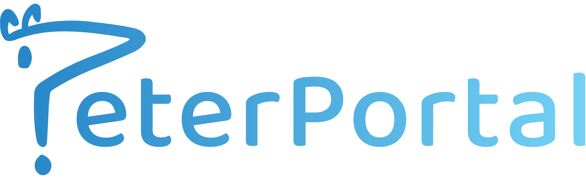

## ℹ️ About

PeterPortal API is a student-developed and maintained project that aims to provide software developers with easy access to publicly available data from the University of California, Irvine. This includes but is not limited to information on courses, instructors, past grade distributions, and much more.

The _Next_ version of the PeterPortal API is rewritten from the ground up, with special emphasis placed on providing a superior experience for developers and users. This will help to further our mission of encouraging fellow student developers to create open-source applications that benefit the Anteater community.

## 🔨 Built with

- AWS CDK
- Docusaurus
- GraphQL
- Prisma
- Turborepo
- TypeScript

## 💪 Powered by

- AWS API Gateway
- AWS Lambda
- AWS RDS

## 📂 Repository Structure

- `api`: Components of the API
- `cdk`: AWS CDK app used for deploying the API
- `db`: Prisma Client configuration shared between API components
- `docs`: Docusaurus app containing the API documentation
- `packages`: Miscellaneous code shared between components
- `tools`: Tools used to maintain and update the API

## 📖 Documentation

🚧 Our documentation is currently under construction. We apologize for the inconvenience.

## ⚠️ Caveats

Please note that while our data is obtained directly from official UCI sources, such as the Catalogue, the Public Records Office, and the Registrar, this is not an official UCI tool. While we strive to keep our data as accurate as possible with the limited support we have from the school, errors can and do happen; please take this into consideration when using this API.

We appreciate any and all reports of erroneous information and will take action as quickly as possible. If while using this API you encounter any such errors or bugs, please open an issue [here](https://github.com/icssc/peterportal-api-next/issues/new).
